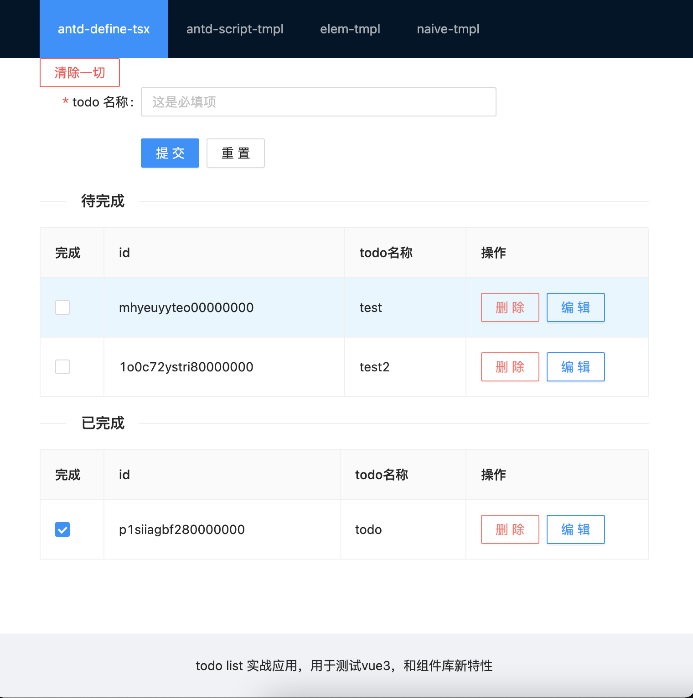
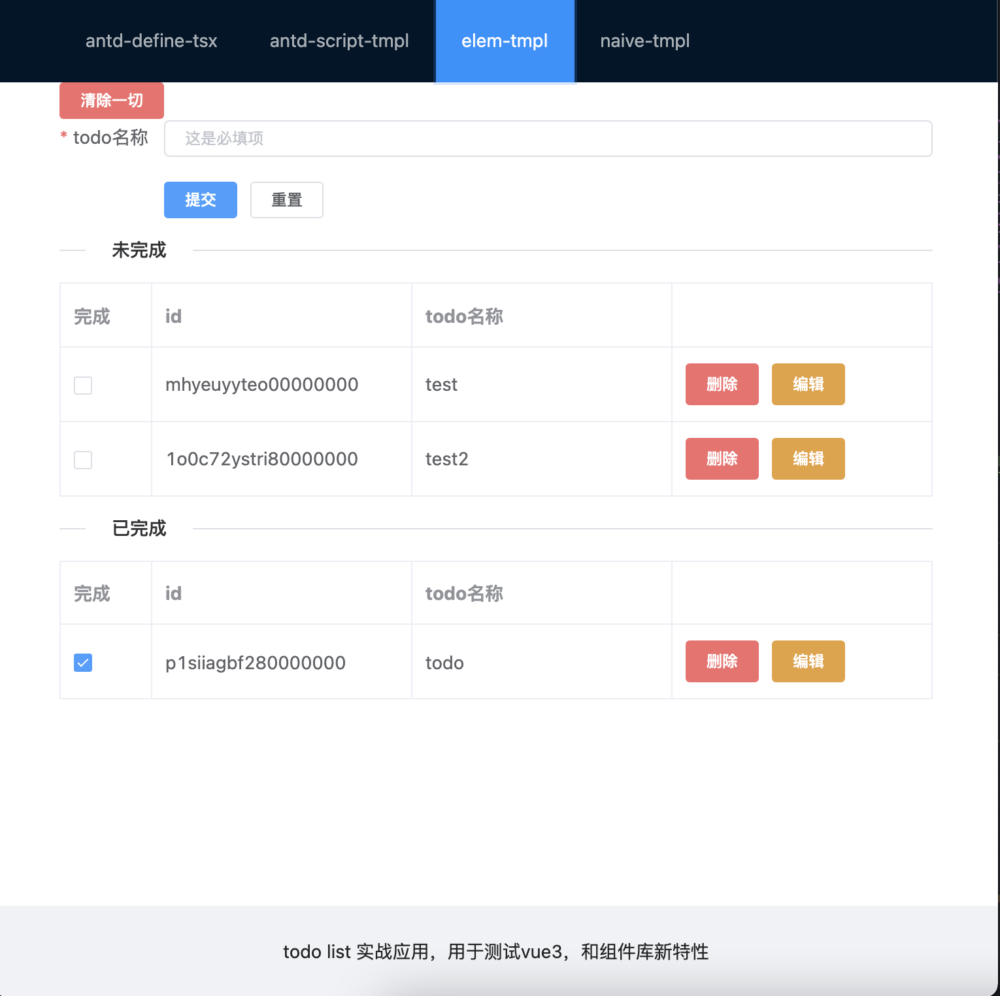

# Vue 3 + Typescript + Vite2 + Pinia2

## Depends

- [Vue 3.x](https://github.com/vuejs/vue-next)
- [Vue-Router 4.x](https://github.com/vuejs/vue-router-next)
- [Pinia2](https://github.com/posva/pinia/) - manage state instead of vuex
- [Ant Design Vue 2.x](https://github.com/vueComponent/ant-design-vue)
- [Element-Plus](https://github.com/element-plus/element-plus) 
- [Naive UI](https://github.com/TuSimple/naive-ui)
- [unplugin-vue-components](https://github.com/antfu/unplugin-vue-components) - a vite plugin can auto import ui library on demand
- TypeScript, of course

## Installation

1. Clone repository `git clone https://github.com/nabaonan/todos-action.git `
2. `cd vue-vite-ts-setup`
3. `yarn` or `npm i`

## Usage

1. Run `yarn`
2. `yarn dev`

## Build

Run `yarn build`

## Preview

