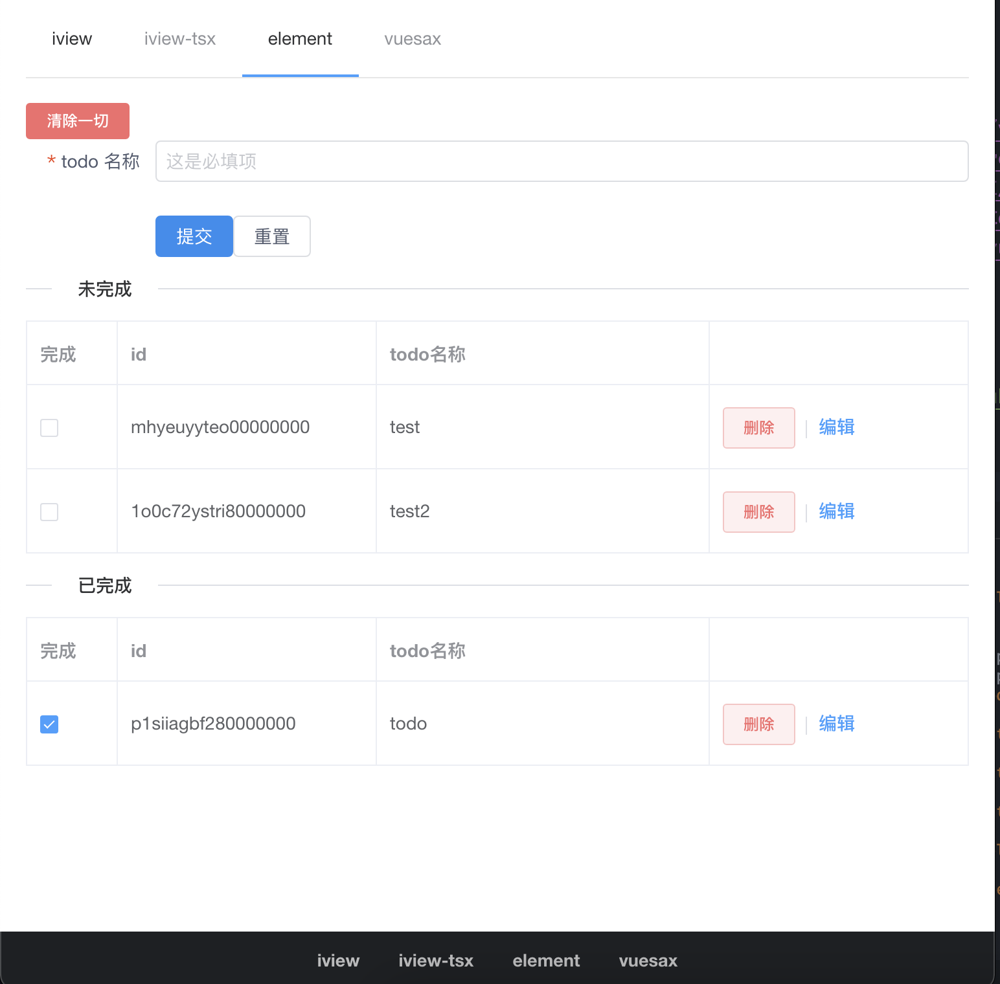
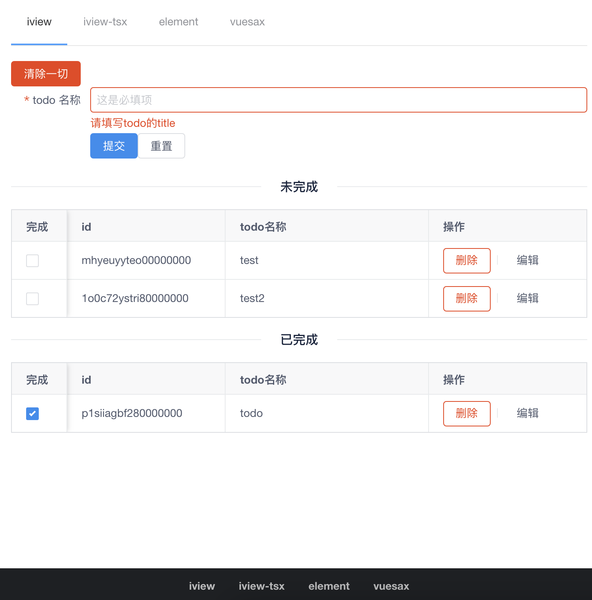
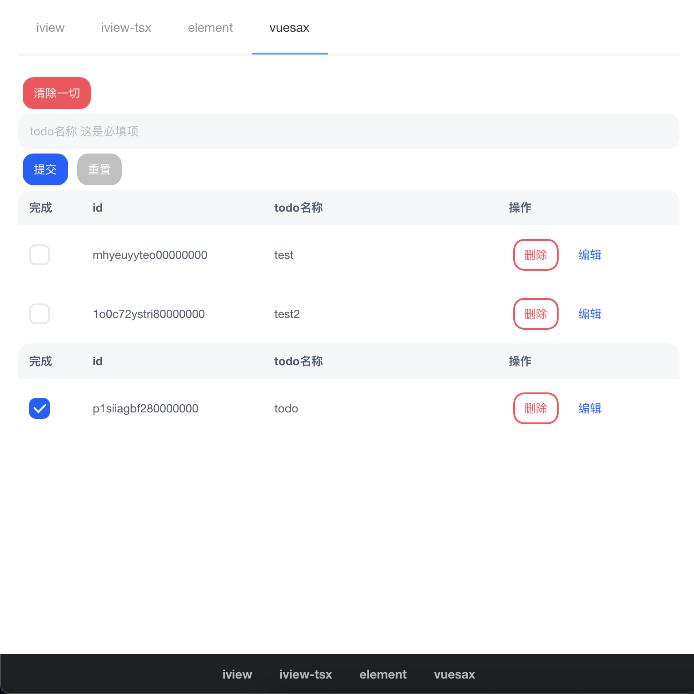

# Vue 2 + Typescript + Vite2 + Pinia1

## Depends

- [Vue 2.x](https://github.com/vuejs/vue)
- [Vue-Router 3.x](https://github.com/vuejs/vue-router)
- [CompositionApi](https://github.com/vuejs/composition-api)
- [Pinia1](https://github.com/posva/pinia/tree/v1) - manage state instead of vuex
- [ElementUI 2.x](https://github.com/ElemeFE/element) 
- [ViewUI](https://github.com/view-design/ViewUI)
- [Vuesax 4.x](https://github.com/lusaxweb/vuesax-next) - still in alpha 
- [Vite-Plugin-Commonjs](https://github.com/originjs/vite-plugins/tree/main/packages/vite-plugin-commonjs) - a plugin resolve commonjs syntax
- [unplugin-vue-components](https://github.com/antfu/unplugin-vue-components) - a vite plugin can auto import ui library on demand
- TypeScript, of course

## Installation

1. Clone repository `git clone https://github.com/nabaonan/todos-action.git `
2. `cd vue2-vite-ts`
3. `yarn` or `npm i`

## Usage

1. Run `yarn`
2. `yarn dev`

## Build

Run `yarn build`

## Preview

